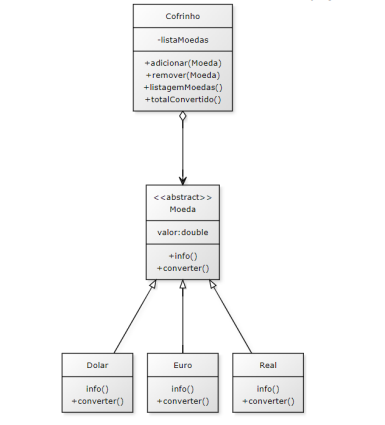

# Cofrinho de Moedas - Sistema CRUD

## Descrição do Projeto

Este projeto é uma implementação de um sistema simples de gerenciamento de um "Cofrinho de Moedas" utilizando a linguagem Java. O objetivo é proporcionar ao usuário a capacidade de adicionar, remover, listar e calcular o valor total das moedas convertidas para Real. O projeto foi desenvolvido com o intuito de aplicar conceitos de herança e polimorfismo.

## Funcionalidades

O sistema oferece as seguintes funcionalidades:

1. Adicionar Moedas: Permite ao usuário adicionar moedas de diferentes valores e países ao cofrinho.
2. Remover Moedas: Permite ao usuário remover moedas específicas do cofrinho.
3. Listar Moedas: Lista todas as moedas que estão dentro do cofrinho.
4. Calcular Total em Real: Calcula e exibe o valor total das moedas convertidas para Real.

## Estrutura do Projeto
Classes Principais:

> Main(principal): Classe responsável por iniciar o sistema e exibir o menu de opções para o usuário. 

> Cofrinho: Classe que contém uma coleção de objetos do tipo Moeda. Esta coleção é usada para gerenciar as moedas no cofrinho.

> Moeda: Classe abstrata que representa uma moeda. As subclasses específicas (Dolar, Euro, Real, etc.) herdam desta classe e implementam métodos específicos.

## Detalhes da Implementação

### Main
A classe Principal será responsável por iniciar o sistema e apresentar o menu de opções ao usuário. Nela serão feitas as chamadas aos métodos das classes Cofrinho e Moeda.

### Cofrinho
A classe Cofrinho possui uma coleção de objetos Moeda, que pode ser implementada utilizando um ArrayList ou outra estrutura de dados pertinente. Esta classe inclui métodos para adicionar, remover, listar moedas e calcular o valor total convertido para Real.

### Moeda
A classe Moeda é abstrata e possui atributo como valor. Ela define um método abstrato converter() que deve ser implementado por todas as subclasses específicas como Real, Dolar, Euro, etc. Cada uma dessas subclasses implementará o método converter() para retornar o valor da moeda em Real.

### Subclasses de Moeda
Cada subclasse de Moeda (Real, Dolar, Euro, etc.) deve implementar o método converter() de forma a realizar a conversão correta para Real. 

## Considerações Finais
Este projeto visa avaliar o uso correto dos conceitos de herança e polimorfismo em Java. A implementação pode ser estendida com novas funcionalidades e melhorias conforme necessário.

Sinta-se à vontade para contribuir com melhorias e sugestões.

